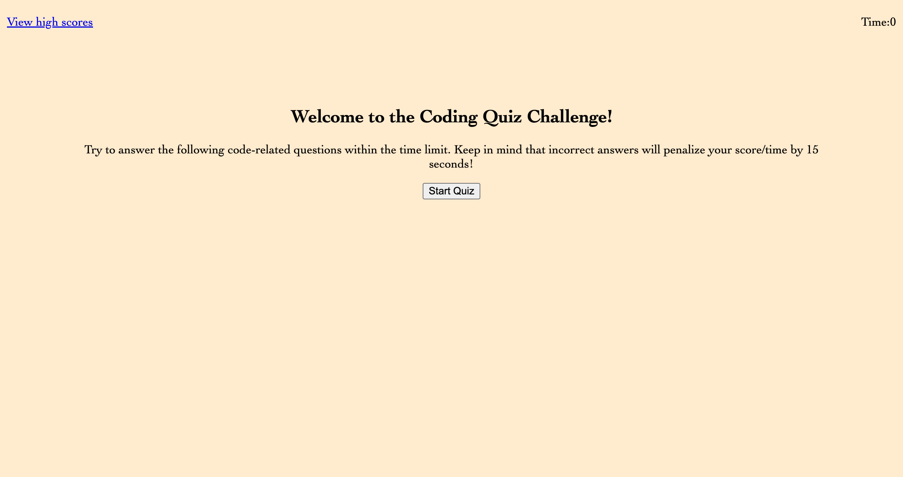

# JavaScript Fundamentals Quiz, Module 4

Fundamentals Quiz

## Description
This is a bootcamp design challenge that has prompted me to create a website that offers a quiz on JavaScript Fundamentals. The user story prompted the creation of the quiz to allow user to compare scores with their peers. The criteria of the project included creating a start button that presents rounds of questions, indicates correct/incorrect response, incorrect responses take time away from a running clock. When the game is over, user can link to high score page. 

## Mockup

https://kristinbrewer.github.io/javascript-fundamentals-quiz/

## Installation
N/a

## Usage
To practice generating JavaScript code, including arrays, functions, objects, conditional statements etc. 

## Credits

N/A

## License 

Please refer to the Licesnse in the repo. 